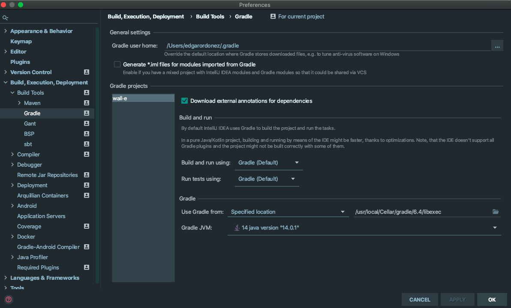
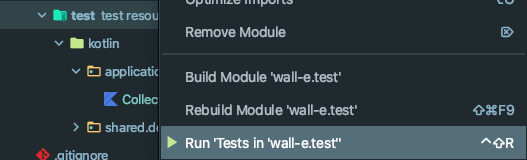

# wall·e 🤖

- Author: Edgar Ordóñez Rodríguez

## Test

- You can find the test description here: [Task](docs/Backend%20Code%20Test.pdf)

## Setup

### Needed tools
- Clone this repository: `git@github.com:edgarordonez/wall-e.git`
- Install Gradle https://gradle.org/install/
    - If you are using IntelliJ:
      - The following settings are recommended:
      
      - For testing this project is using [Spek Framework](https://www.spekframework.org/). To run tests in IntelliJ  you need to install the [Spek Framework plugin](https://plugins.jetbrains.com/plugin/10915-spek-framework).

### How I should run the tests and the robot?

#### IntelliJ
1. Open: `src/main/kotlin/code/seat/wall_e/Application.kt`
2. Execute main ▶️ to run the project

3. Left click in `src/test`
4. Run 'Test' ▶️

#### Gradle
1. Type in your terminal: `./gradlew run` to run the project
2. Type in your terminal: `./gradlew test` to run the tests